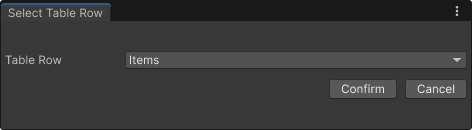
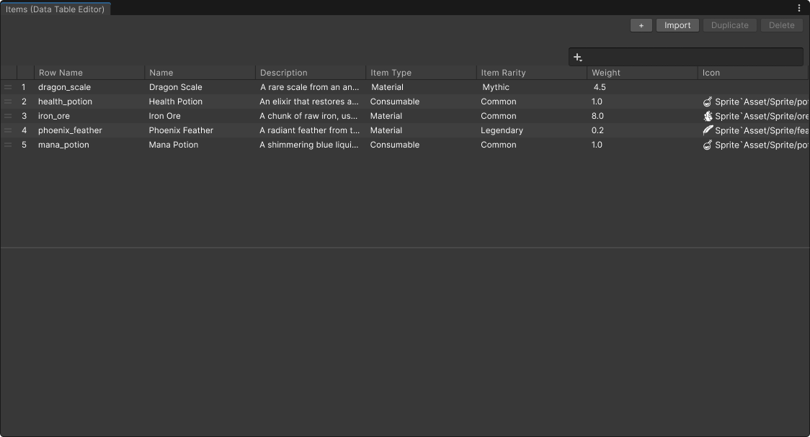
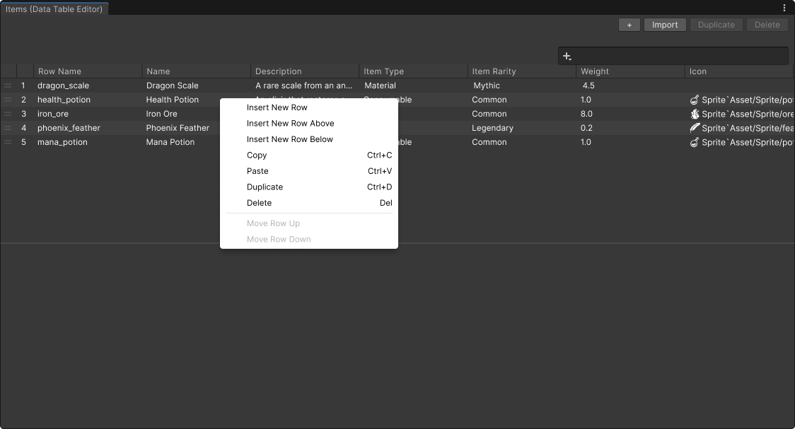
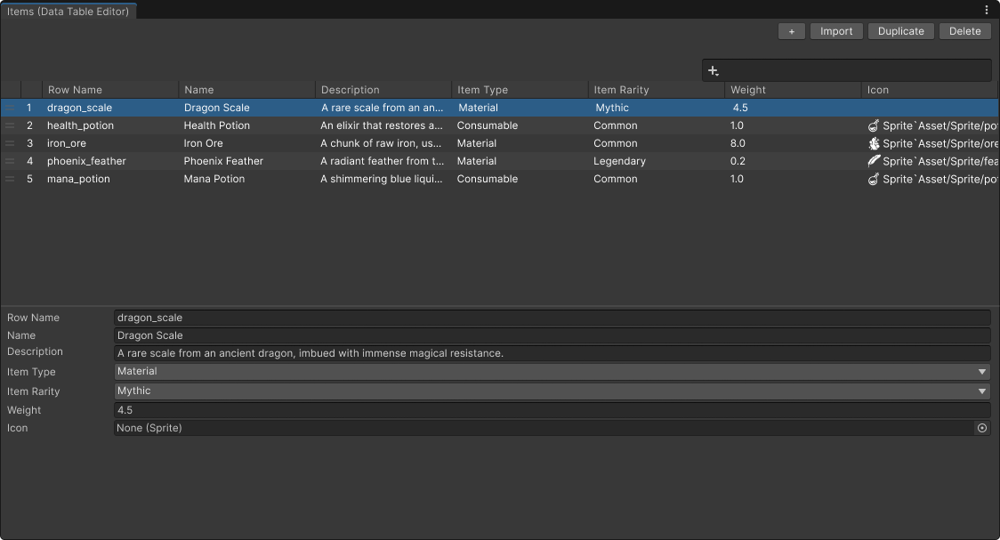

!(Data Table Logo)[images/d_data_table_icon.png]

## Table Contents
- [Overview](#overview)
- [Features](#features)
- [Guide](#guide)
- [Reference](#reference)
- [Known Limitations](#known-limitations)

## **Overview**
Simple plugin which allows managing data in spreadsheet style within Unity. View your data table asset within its custom Editor Window where you can create, edit, delete and duplicate rows of data

## **Features**
- Undo Support - Seamlessly integrated with Unity's Undo System which allows to revert changes.
- Import/Export - Easily import or export your data in CSV and JSON format.
- Copy/Paste - Copy rows of data. Paste data back to Data table with data validation
- Search Filtering - Search and Filter by value and field-based filter (e.g. item_weight>=20, rarity=Rare, item_name$="Mythril ").
- Sorting - Easily sort by column values in ascending/descending.
- Reordering - Seamlessly reposition row of data through drag and drop or context menu
- Multiple Windows - Open multiple Data Table assets simultaneously.

## **Guide**

1. **Create Table Row**:
	-  Navigate to `Assets > Create > Scripting > Data Table > Table Row`:
```c#
	using System;
	using UnityEngine;
	using BlindGooseStudio.Datatable;
	
	public enum ItemType
	{
		Consumable,
		Material,
		Equipment
	}
	
	public enum ItemRarity 
	{
		Common,
		Uncommon,
		Rare,
		Mythic,
		Legendary
	}
	
	[Serializable]
	public class ItemsRow : TableRow
	{
		public string name;
		[Multiline(2)]
		public string description;
		public ItemRarity rarity;
		public ItemType type;
		[Min(0.1)]
		public float weight;
		public Sprite icon;
	}
```

2. Create Data Table:
	- Select structure use by Data Table<br/>
	 
3. Open Data Table Editor:
	- Double click the Data Table asset to open Data Table Editor\n
	 
	 
	 

#### **Keyboard Shortcuts**
- **CTRL + A** - Select all rows.
- **CTRL + C** - Copy selected row/s
- **CTRL + V** - Paste copied data back to selected row/s, with validation and automatic insertion.
- **CTRL + D** - Duplicate selected rows
- **Del** - Delete selected row/s.
- **F3** - Focus Search Field.
- **CTRL + S** - Save changes to data table asset.


## **Reference**
### **Data Table Row Handle**
- `GetRow() or GetRow<T>()` - returns Table Row
- `IsValid()` - returns true if table != null and row name is not empty or null

### **Data Table**
- `this[string rowName]` - Indexer for getting row by row name.
	- `get` - Returns the row if found, else null.
	- `set` - Assigns a row to specified `rowName`. The value must match the table's schema type, otherwise assignment is rejected.
- `Count` - Get the number of rows in the table.
- `Row` - Gets the default `TableRow` used by this data table.             This property is primary exposed for use in editor window to read default values when adding new row.
- `AddRow` - Add a new row to data table using provided string row name and `TableRow` value. The value must match the table's schema type
- `AppendRow<T>` - Add rows of data into data table. if key exist it doesn't add it.
- `GetRows` - Get all the rows in the table regardless of the name.
- `TryAddRow` - Attempts to add row into data table. returns true if row is added, else false if row name already exist.
- `RemoveRow` - Remove row by row name. if row name exist and was removed returns true else false.
- `GetRow` - Get the row by row name. returns if found, else null.
- `GetRow<T>` - Get row by row name and cast it to `T`. returns `T` if the row exists and matches the schema, else null.
- `FindRows` - Finds all rows that match given predicate.
- `FindRows<T>` - Finds all rows that match specified predicate after validating if T matches the table's schema type. if the `T` doesn't match with schema, returns empty `IEnumerable`

## **Known Limitations**
- **Collection fields** - A collections(Array or List) nested inside another collections, since it can't be serialize by unity
- **Asset Deletion** - When asset is deleted it will close any opened editor window that has asset
